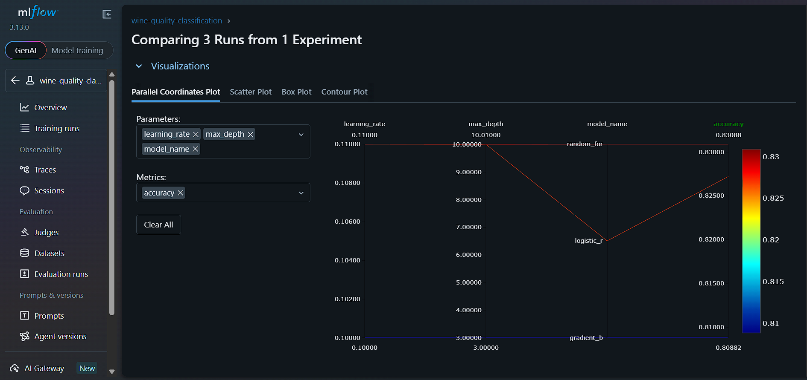
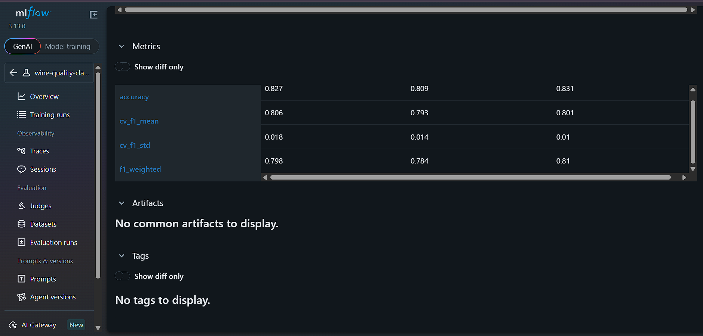
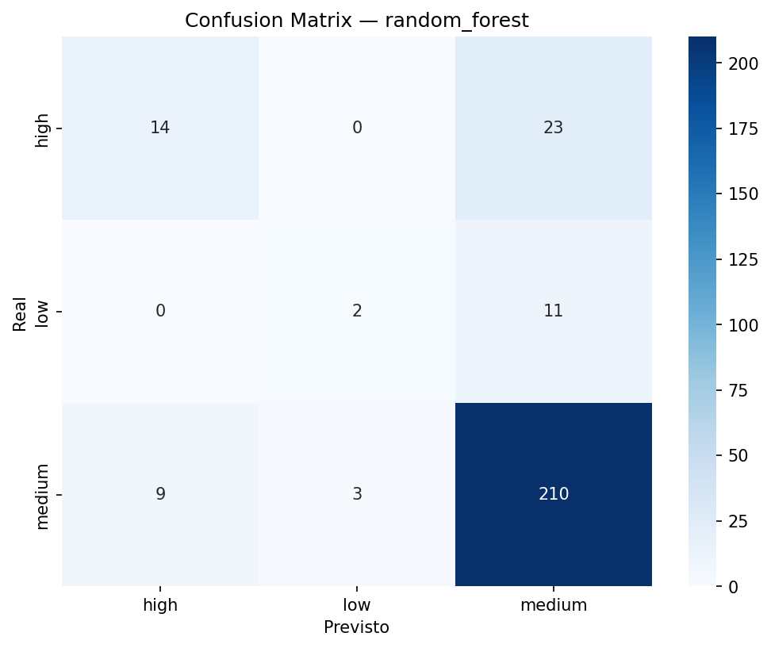

# 🍷 ML Pipeline com MLflow — Wine Quality Classification

Pipeline completo de Machine Learning com rastreamento de experimentos, versionamento de dados e registro de modelos.


## 📋 Sobre o Projeto

Classificação da qualidade de vinhos tintos (low / medium / high) a partir de características químicas, com foco em **reprodutibilidade** e **rastreamento de experimentos**.

**Dataset:** [Wine Quality — UCI ML Repository](https://archive.ics.uci.edu/ml/datasets/wine+quality)
- 1.599 amostras, 11 features químicas
- Após limpeza: 1.359 amostras
- Split: 1.087 treino / 272 teste

## 🏗️ Arquitetura do Pipeline

```
data/raw/ → preprocessing.py → data/processed/ → engineering.py → train.py → MLflow
```

## 🔬 Experimentos — Comparação de Modelos

| Modelo | Accuracy | F1 Weighted | CV F1 Mean | CV F1 Std |
|--------|----------|-------------|------------|-----------|
| **Random Forest** | **0.831** | **0.810** | **0.801** | 0.010 |
| Logistic Regression | 0.827 | 0.798 | 0.806 | 0.018 |
| Gradient Boosting | 0.809 | 0.784 | 0.793 | 0.014 |

### MLflow — Comparação de Runs





### Confusion Matrix — Random Forest (melhor modelo)



## ⚙️ Feature Engineering

Novas features criadas a partir das originais:

| Feature | Fórmula | Intuição |
|---------|---------|----------|
| `acid_ratio` | fixed_acidity / volatile_acidity | Equilíbrio ácido |
| `sulfur_ratio` | free_SO₂ / total_SO₂ | Eficiência do sulfito |
| `alcohol_density` | alcohol / density | Corpo do vinho |

## 🚀 Como Reproduzir

### 1. Clone e configure o ambiente

```bash
git clone https://github.com/seu-usuario/ml-pipeline-mlflow.git
cd ml-pipeline-mlflow
python -m venv venv
venv\Scripts\activate  # Windows
pip install -r requirements.txt
```

### 2. Rode o pipeline completo

```bash
# Preprocessing
python src/data/preprocessing.py

# Feature engineering
python src/features/engineering.py

# Treino + tracking MLflow
python -m src.models.train

# Avaliação do melhor modelo
python -m src.models.evaluate
```

### 3. Visualize os experimentos

```bash
mlflow ui --backend-store-uri sqlite:///mlflow.db
```

Acesse: http://127.0.0.1:5000

## 📁 Estrutura do Projeto

```
ml-pipeline-mlflow/
├── data/
│   ├── raw/                  # Dados brutos (versionados com DVC)
│   └── processed/            # Features processadas
├── src/
│   ├── data/preprocessing.py # Limpeza e split
│   ├── features/engineering.py # Feature engineering
│   ├── models/
│   │   ├── train.py          # Treino + MLflow tracking
│   │   └── evaluate.py       # Avaliação do melhor modelo
│   └── utils/
├── screenshots/              # MLflow UI screenshots
├── requirements.txt
└── README.md
```

## 📊 Resultados

O **Random Forest** obteve o melhor desempenho com **83.1% de accuracy** e **F1 de 0.81**, com baixa variância no cross-validation (±0.010), indicando boa generalização.

A classe `medium` domina o dataset (82% das amostras), o que explica o desempenho inferior nas classes `low` e `high` — um trade-off esperado e documentado.